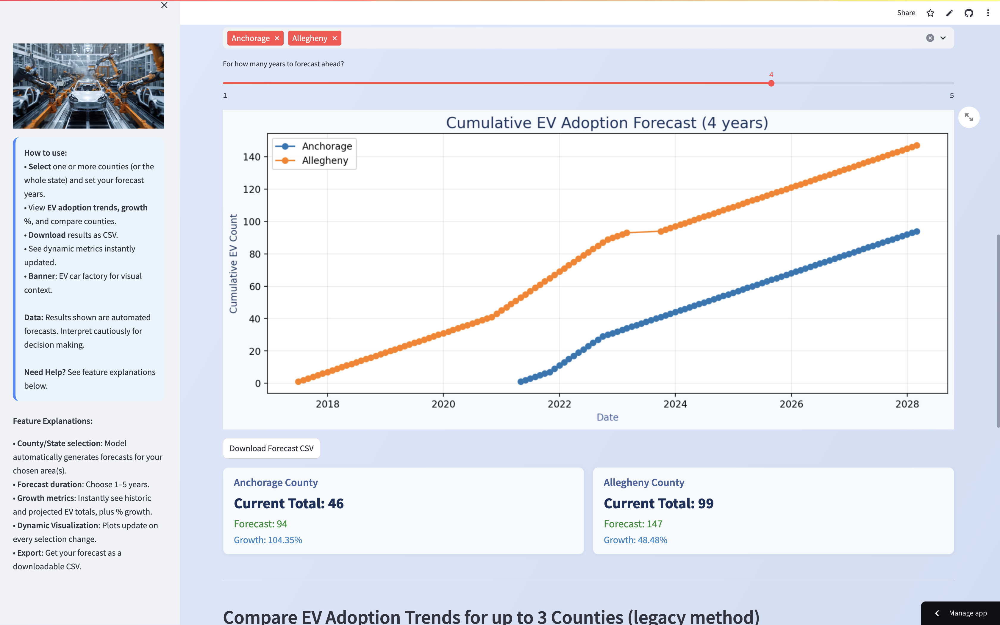
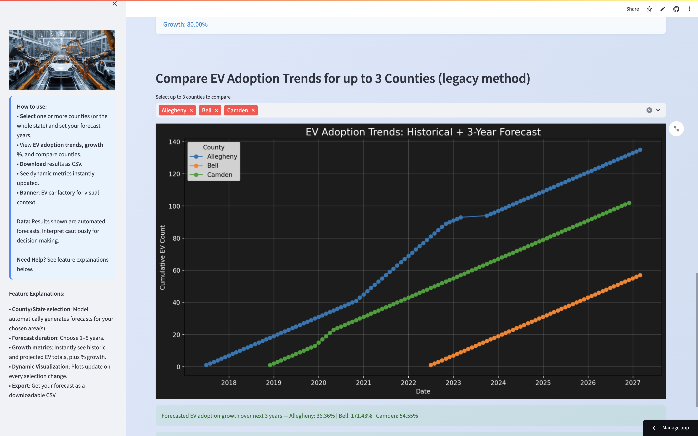
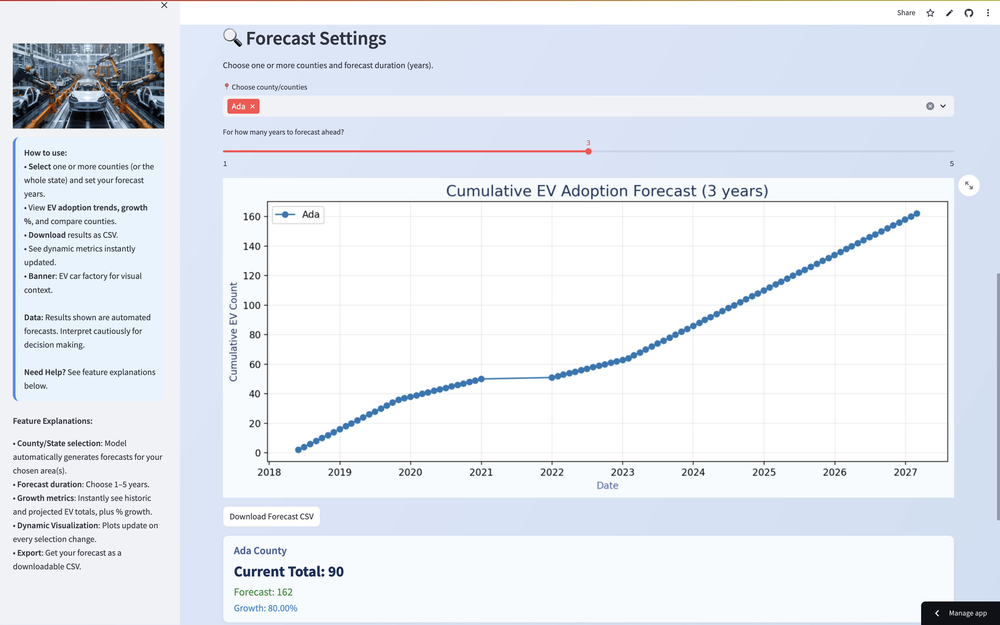

# ⚡ EV Adoption Forecasting App

A user-interactive forecasting tool built using Streamlit that predicts the growth of Electric Vehicle (EV) adoption over the next 1–5 years. Developed as part of the **Edunet AICTE Skill4Future Internship (Cycle 2)** – Week 3 Project.

🔗 **Live App**: [Click here to view the deployed app](https://evvehiclechargedemand-ks6y7qnqpenjnvkp7apdpo.streamlit.app/)

---

## 👤 Author

**Name**: Hemanth Nayak  
**Internship**: Edunet AICTE Skill4Future Internship – Cycle 2  
**Project Week**: Week 3  
**Project Title**: EV Adoption Forecasting Tool

---

## 🎯 Learning Objectives

- Understand and preprocess time series data
- Implement forecasting using regression models
- Build interactive dashboards using **Streamlit**
- Integrate input validations and export functionalities
- Deploy web apps using **Streamlit Cloud**

---

## 📌 Project Overview

This application forecasts EV adoption trends across Indian states/regions using historical data. Users can choose the forecast duration (1–5 years), select specific regions, and visualize future growth metrics. It also supports CSV export of forecast results for further analysis.

---

## 🧰 Tools and Technologies Used

- **Python 3.10+**
- **Streamlit**
- **Pandas**
- **NumPy**
- **Scikit-learn**
- **Statsmodels**
- **Matplotlib / Seaborn**
- **Rich** (for terminal text styling)

---

## 📋 Methodology

1. **Data Loading & Preprocessing**  
   Utilized a cleaned dataset: `preprocessed_ev_data.csv`.

2. **Forecasting Logic**  
   Applied linear regression to model EV growth over time per region.

3. **Interactive UI**  
   - Multiselect region dropdown with selection limit warning  
   - Year slider (1 to 5 years forecast)  
   - Key metric cards for growth percentage, current EVs, etc.

4. **Outputs**  
   - Forecast plots with historical + future trends  
   - Downloadable CSV of forecasts  
   - Styled Streamlit dashboard with sidebar info

---

## ❗ Problem Statement

Despite a rapid rise in electric vehicle adoption, stakeholders lack an accessible, visual tool to forecast regional EV trends. This gap limits data-driven decisions for policymakers, infrastructure planners, and EV manufacturers.

---

## ✅ Solution

An intuitive and responsive web application that:
- Forecasts EV adoption per region over 1–5 years
- Displays insights on growth percentages and volume
- Enables stakeholders to download and analyze data
- Offers a polished and interactive visual interface

---

## 🚀 Key Features Implemented

- 📅 **Forecast Duration Selector** (1–5 years)
- 🧾 **Download Forecast as CSV**
- 📈 **Key Metrics Display** (Total EVs, Growth %)
- ⚠️ **Selection Limit Warning** (Max 5 regions)
- 💬 **Sidebar Info Panel** (Usage help and guidance)
- 🎨 **Custom Background Gradient & UI Styling**
- 🖼️ **Banner Image** (`ev-car-factory.jpg`) for visual appeal

---

## 🖼️ Screenshot of Output

Explore the user interface and features of the deployed EV Adoption Forecasting App:

### 🚗 Forecasting Dashboard  
Displays current EV stats and forecast input options.  

---

### 🌍 Multi-County Comparison  
Compare EV adoption across selected counties using multiselect.  

---

### 📈 Forecast Visualization  
Graphical forecast output for selected duration.  

---

### 📥 Data Export Feature  
Download the forecasted results as CSV.  

---

## 📂 Dataset Used

- **File**: `preprocessed_ev_data.csv`  
- **Description**: Cleaned dataset of EV adoption counts across multiple Indian regions over a span of years.

---

## 🖥️ Deployment

- Hosted on **Streamlit Cloud**
- 🔗 [Live App](https://evvehiclechargedemand-ks6y7qnqpenjnvkp7apdpo.streamlit.app/)

---

## 📎 GitHub Repository

🔗 [GitHub Repo](https://github.com/hemannayak/EV_Vehicle_Charge_Demand) 

---

## 📘 License

This project is open-sourced under the MIT License.  
© 2025 Hemanth Nayak

